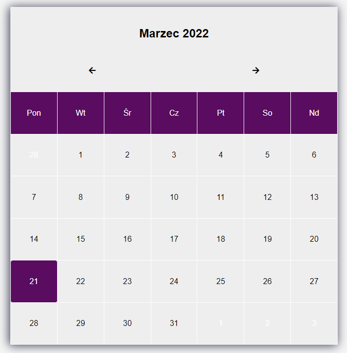
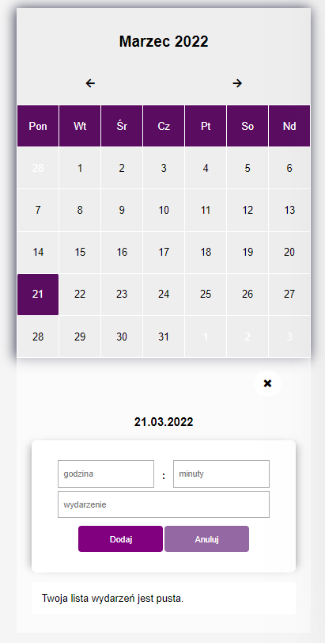
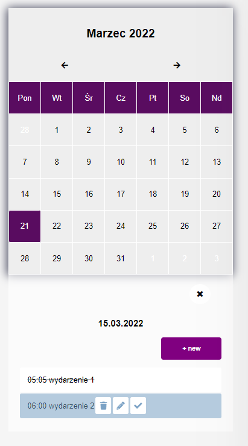

# Klika małych projektów JavaScript-HTML-CSS-PHP

# 1. Kalendarz
## Opis
* Aplikacja ma za zadanie wyświetlić kalendarz na miesiąc. 
* Umożliwia przewiajnie na nastepny lub poprzedni miesiąc.
* Wyróżnia aktualną date 
* Mozliwość dodania listy zadań do danego dnia
* Edytowanie listy zadań, usunięcie oraz odznaczenie zadania.

## Technologie
* JavaScript, PHP, HTML, CSS, MySQL

# Instalacja projektu
## Wymagania 
* PHP 7
* Uwamp/Xampp

## Uruchomienie projektu
1. Pobrać repozytorium
2. Stworzyć baze danych na lokalhost. Baze nalezy zaimportować z pliku ```baza.sql```. Plik zanjduje się w projekcie
3. W folderze ```/global/database/db.php``` ustawić baze danych.
4. w pliku ```/global/js.ajax.js``` podac ścieżke bazowo projektu

# Interface aplikacji






# 2. Gra 
W trakcie tworzenia 


