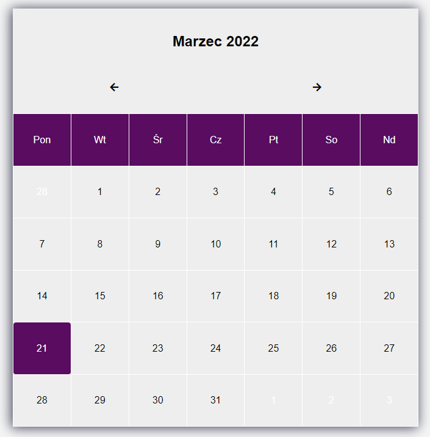
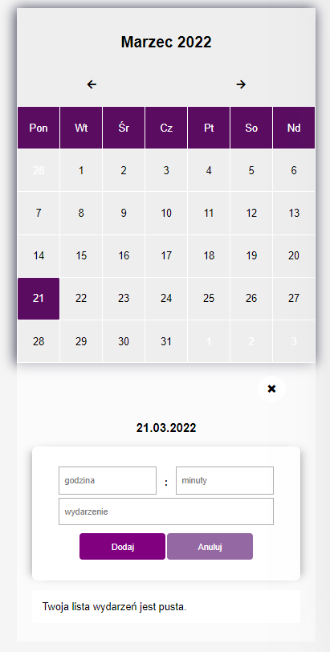
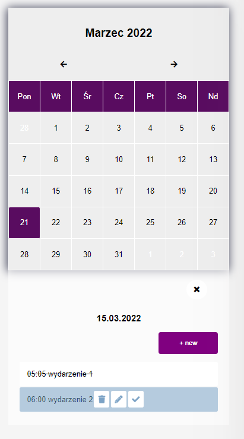
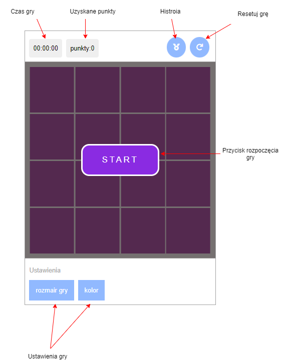
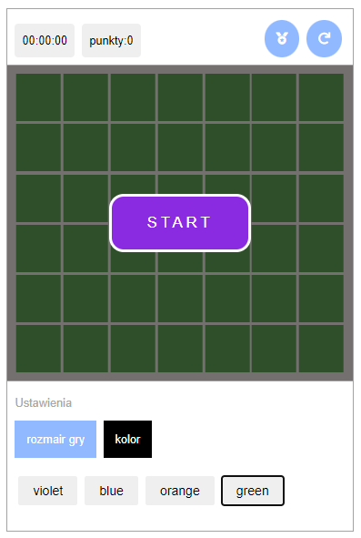
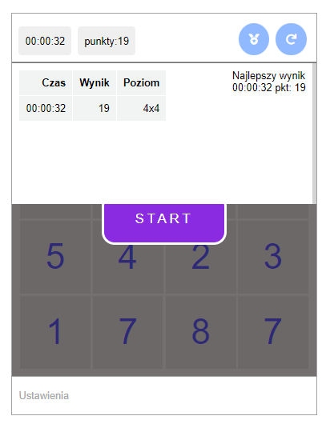
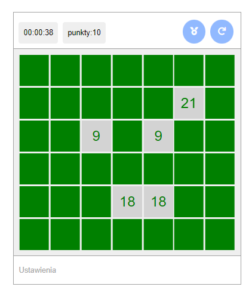
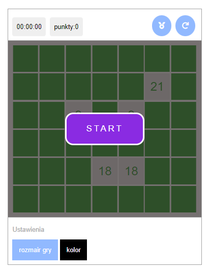
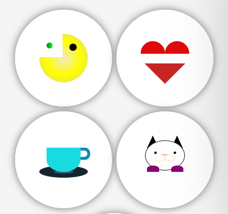

<!-- # Klika małych projektów JavaScript-HTML-CSS-PHP -->

# 1. Kalendarz
## Opis
* Aplikacja ma za zadanie wyświetlić kalendarz na miesiąc. 
* Umożliwia przewiajnie na nastepny lub poprzedni miesiąc.
* Wyróżnia aktualną date 
* Mozliwość dodania listy zadań do danego dnia
* Edytowanie listy zadań, usunięcie oraz odznaczenie zadania.


## Interface aplikacji
<div style='display: flex; align-items:start'> 




<div>

## Technologie
* JavaScript, PHP, HTML, CSS, MySQL, AJAX

## Instalacja projektu
### Wymagania 
* PHP 7
* Uwamp/Xampp

### Uruchomienie projektu
1. Pobrać repozytorium
2. Stworzyć baze danych na lokalhost. Baze nalezy zaimportować z pliku ```baza.sql```. Plik zanjduje się w projekcie
3. W folderze ```/global/database/db.php``` ustawić baze danych.
4. w pliku ```/global/js.ajax.js``` podac ścieżke bazowo projektu

<!-- 






 -->


# 2. Gra 

Gra Memory Game. Polega na znalezieniu par kart z tą samą liczbą. Jeśli karty są takie same
to pozostają odkrytę. Natomiat w przeciwnym wypaku są ponownie zakrywane. Gra trwa do momentu znalezienia wszystkich par.
Po zakończeniu wynik jest zapisywany do historii.
W trakcie rozgrywki, grę można zresetować i zacząć od początku. 
## Opis
* Implementacja gry "Memory Game".
* Mozliwość ustawienia poziomu trudności gry oraz koloru kart.
* Restart gry -> górny prawy przycisk.
* Historia gry -> górny lewy przycisk.
* Zliczanie punktów i czasu gry -> lewa strony górnej belki.

## Interface aplikacji
<div style='display: flex; align-items:start'> 


<div>

## Technologie
* HTML, CSS, JS 

# 3. Ikony

Projekt powstał w celu nauki CSS.

## Opis

Powstały min. takie ikony jak: packman, serce, kot, filiżanka 

## 
<div style='display: flex; align-items:start'> 

<div>


